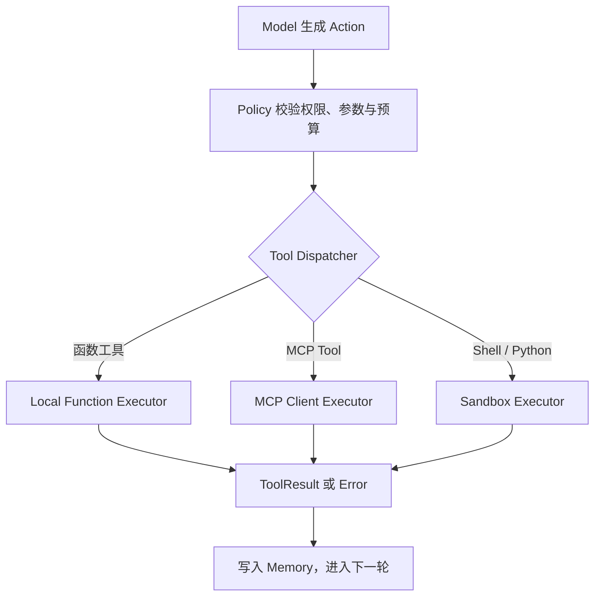

# Agent 中工具如何使用

- 日期: 2026-09-29
- 学习范围: ToolCallingAgent、CodeAgent、函数工具、MCP Tool、Skill Script 与 Executor
- 状态: 学习中

## 一、工具的基本认识

【我的理解】

- 工具是通过JSON格式来定义的：包括名称、描述、参数类型等
- 要构建一个最小化的Agent，必须要具备三个内容：Profile Prompt角色定义、Model用于驱动智能体的文本生成模型、Tool允许智能体使用来完成任务
- 工具是一种由智能体调用的原子级函数，包含了工具名称、描述、输入类型与描述、输出类型，这些属性用于向LLM说明如何调用工具

【AI 补充与校正】

- JSON 或 JSON Schema 描述的是工具接口，包括名称、用途、输入字段和类型。完整工具还包含实际实现、执行位置、权限、副作用、超时和错误语义。
- 最小 Agent 的主干可以表示为 Profile/Instructions、Model、Tool 和 Agent Loop。Agent Loop 负责把任务交给 Model、解析动作、执行 Tool、回填观察并判断结束。
- Tool 通常提供一个边界清晰的动作。搜索、读取文件、调用 API 适合设计为原子工具；Shell 和 Python Executor 可以承载由多条命令或代码组成的复合动作。

## 二、ToolCallingAgent 与 CodeAgent

【当前理解】

smolagents 对两类 Agent 的划分描述的是动作表达与执行方式：

| 类型 | Model 生成的动作 | Harness 的处理方式 |
| --- | --- | --- |
| `ToolCallingAgent` | 包含工具名称和参数的结构化 ToolCall | 校验参数后调用已注册工具 |
| `CodeAgent` | Python 代码 | 在受控 Python Executor 中运行代码，代码可以调用绑定的工具函数 |

OpenCode、Codex 等完整编程助手可以同时具备两种能力。例如，Model 先生成一个结构化 `shell` ToolCall，参数中包含 Bash 或 Python 指令；从 Agent Loop 看这是工具调用，从执行内容看它具有代码生成和执行能力。

```text
ToolCall:
  name: shell
  arguments:
    command: python analyze.py
```

代码和命令进入沙箱或受控执行环境。普通工具调用同样经过 Policy 和执行层，只是由不同的执行后端负责：



## 三、函数工具、MCP Tool 与 Skill Script

这三类能力都可以帮助 Model 完成任务，但它们进入上下文和运行环境的方式不同。

| 能力 | Model 最初看到的内容 | 调用方式 | 实际执行位置 |
| --- | --- | --- | --- |
| `@tool` 函数 | 名称、描述、输入 schema 和输出类型 | 结构化 ToolCall | Harness 当前进程或本地 Worker |
| MCP Tool | 名称、描述、`inputSchema` 和可选 `outputSchema` | 结构化 ToolCall | MCP Server 所在进程或远程服务 |
| Skill | 名称、描述、路径等发现元数据 | 先加载 `SKILL.md`，再按指令使用工具 | Skill 本身不执行动作 |
| Skill Script | 通常不进入初始上下文 | 根据 `SKILL.md` 通过 Shell、Python 或包装工具运行 | 本地进程、Worker 或沙箱 |

### 1. `@tool` 函数

`@tool` 将 Python 函数转换为框架可注册的 Tool。Model 通常看到工具接口，不读取函数实现源码：

```json
{
  "name": "search_text",
  "description": "Search text in workspace files.",
  "parameters": {
    "query": {
      "type": "string"
    }
  }
}
```

调用链为：

```text
Model ToolCall
→ Tool Registry 定位 callable
→ 参数校验与 Policy 判断
→ 调用 Python 函数
→ 捕获返回值或异常
→ 生成 ToolResult
```

函数工具可能访问文件、网络和外部服务，因此也需要权限、超时、结果大小和日志控制。

### 2. MCP Tool

MCP Client 通过 `tools/list` 从 MCP Server 获取工具定义，并转换为 Harness 内部的 Tool schema。Model 生成调用后，MCP Client 使用 `tools/call` 将名称和参数发送给 Server：

```text
Model ToolCall
→ Tool Registry
→ MCP Client
→ stdio 或 Streamable HTTP
→ MCP Server 执行业务逻辑
→ MCP Result
→ Harness 生成统一 ToolResult
```

Model 可以用相同方式选择本地函数工具和 MCP Tool。Harness 执行层需要处理 MCP 的连接、认证、超时、协议错误、服务端错误和多类型返回内容。

### 3. Skill 与 Script

Skill 是可复用的工作流知识包。发现阶段向 Model 提供名称和描述等摘要；当任务匹配时，再读取完整 `SKILL.md`。Skill 可以说明工具调用顺序、失败处理方法、产出格式和完成条件。

Skill 中的 `scripts/` 保存确定性处理程序。Script 本身不会自动注册为 Tool，可以采用以下执行方式：

1. `SKILL.md` 指导 Model 通过 Shell 或 Python Executor 运行 Script。
2. Harness 将 Script 包装为本地函数工具。
3. MCP Server 将 Script 能力包装为 MCP Tool。

第一种方式使用代码执行策略和沙箱边界；后两种方式向 Model 暴露稳定的工具 schema，并隐藏内部脚本实现。

## 四、上下文中的位置

一次 Model 调用的有效上下文可以包含以下信息：

```text
System / Developer Instructions
User Task
Conversation 与 Memory
当前可用 Tool Definitions
Skill Discovery Metadata
按需加载的 SKILL.md 或参考资料
上一轮 ToolResult / Observation
```

- 函数工具和 MCP Tool 的定义通常进入模型 API 的 `tools` 字段，或由框架渲染到工具说明中。它们都占用有效上下文，并直接支持结构化调用。
- Skill 初始只暴露少量发现元数据。完整指令与支持文件按需加载，用来控制上下文占用。
- Script 源码通常不会自动加入上下文。Model 可以只知道执行命令和预期结果；排障或修改 Script 时才需要读取源码。

## 五、自研 Harness 的实现边界

【AI 推断，需通过后续实现核验】

自研 Harness 可以使用一个统一 Agent Loop 和 Tool Registry，并为不同来源提供执行适配器：

```python
class ToolDefinition:
    name: str
    description: str
    input_schema: dict
    backend: LocalFunctionBackend | McpBackend | SandboxBackend


class SkillDescriptor:
    name: str
    description: str
    path: str
```

推荐运行链路：

1. Context Builder 注入 Tool schema 和 Skill 摘要。
2. Model 生成 ToolCall、请求加载 Skill 或返回最终答案。
3. Skill Loader 按需加载 `SKILL.md` 和指定资源。
4. Policy 校验工具权限、工作区、审批、预算和参数。
5. Tool Dispatcher 根据 backend 选择本地函数、MCP Client 或 Sandbox Executor。
6. 执行结果统一转换为 ToolResult，写入 Memory 并进入下一轮。

当前术语边界：

- Tool 表示一次可调用动作。
- Skill 表示完成一类任务的可复用方法。
- Script 表示 Skill 携带的确定性实现资源。
- Executor 表示实际承载动作的运行环境或执行适配器。
- Policy 决定动作是否允许、是否审批以及适用的资源预算。

## 六、工具 schema 与轮次衔接

### 1. 工具 schema 会被放进哪条消息？

【观察】使用无网络 Spy Model 运行 smolagents 1.26.0 的 `ToolCallingAgent`，在 Model 调用边界观察到两份工具信息：

1. system message 中包含工具名称、描述、输入字段与输出类型的文本说明。
2. Model 的 `tools_to_call_from` 参数中包含 `add_two_ints` 和 `final_answer` 两个 Tool 对象。

因此，对当前 smolagents 可以回答：工具说明被渲染进 system message，同时以独立工具集合交给 Model Adapter。Model Adapter 再根据 Provider 能力，把工具集合转换为原生 API 的 `tools` 字段或兼容格式。

这不是所有 Agent Loop 必须采用的消息布局。可迁移到其他 Harness 的稳定结论是：每次需要工具决策的 Model 调用，都要同时提供当前可用工具目录；目录可以位于模型 API 的独立 `tools` 字段、system/developer instructions 或按需工具检索结果中。

### 2. 一次调用和下一轮消息如何衔接？

【观察】同一个 Spy Model 实验产生两轮调用：

```text
第一轮输入:
system + user task + available tools

第一轮输出:
assistant tool call: add_two_ints(a=2, b=4)

Harness:
校验参数 → 执行工具 → 得到 6 → 写入 Memory

第二轮输入:
system + user task
+ tool-call record
+ tool-response: Observation: 6
+ available tools

第二轮输出:
final_answer(answer=6)
```

smolagents 的内部消息使用 `tool-call` 和 `tool-response` 表达动作与观察，Model Adapter 可以把它们转换为 Provider 所需的 assistant/tool 消息及 tool call ID 关联格式。

可迁移到其他 Agent Loop 的稳定关系是：一次工具调用产生 `ToolCall`，Harness 执行后生成与该调用关联的 `ToolResult`，两者一起进入 Memory；Context Builder 在下一轮把任务历史、调用和结果组装给 Model。具体角色名、消息数量和字段名由 Harness 与 Provider 协议决定。

### 3. `assistant`、`tool-call` 与 `tool-response` 的区别

【观察】实际运行日志的第二轮包含以下三条内部消息：

| smolagents 内部角色 | 信息来源 | 表达内容 | 当前日志中的值 |
| --- | --- | --- | --- |
| `assistant` | Model | 该轮模型生成的普通文本内容 | 空字符串，因为该轮只生成了工具调用 |
| `tool-call` | Model 决策，经 Harness 解析后记录 | 调用 ID、工具名称和参数 | `add_numbers(a=2, b=4)` |
| `tool-response` | Tool/Executor 执行，经 Harness 记录 | 与调用对应的结果或错误 | `Observation: 6` |

`tool-call` 和 `tool-response` 是 smolagents 为 Memory、replay 和 Provider 适配定义的内部语义角色，不是通用模型 API 必须提供的原生角色。它们表达的是事件类型，而不是新的对话参与者。

在常见的 Chat Completions 工具调用格式中，同一过程通常表示为：

```json
[
  {
    "role": "assistant",
    "content": null,
    "tool_calls": [
      {
        "id": "call_123",
        "type": "function",
        "function": {
          "name": "add_numbers",
          "arguments": "{\"a\":2,\"b\":4}"
        }
      }
    ]
  },
  {
    "role": "tool",
    "tool_call_id": "call_123",
    "content": "6"
  }
]
```

这里没有原生 `tool-call` 角色。工具调用属于 `assistant` 消息的 `tool_calls` 字段，工具执行结果使用 `tool` 角色，并通过 `tool_call_id` 与调用对应。

不同协议可以使用不同表示：

- Chat Completions 使用 message role 与 `tool_calls`/`tool_call_id`。
- Responses API 将工具调用和结果表示为 `function_call` 与 `function_call_output` 等带类型的 Item。
- smolagents 在内部使用 `assistant`、`tool-call` 和 `tool-response` 保存统一轨迹，再由 Model Adapter 转换为 Provider 支持的格式。

因此，`system`、`user`、`assistant`、`tool` 是一种 Provider 消息协议；smolagents 的五个 `MessageRole` 是 Harness 内部数据模型，两者不要求完全一致。

【当前结论】

- 工具 schema 属于 Model 调用的能力描述，不必绑定到某一种消息角色。
- ToolCall 与 ToolResult 通过调用 ID 或 Harness 内部步骤记录建立对应关系。
- Agent Loop 的核心职责是保存这个对应关系，并把结果作为下一轮可观察状态提供给 Model。
- 学习和验收应检查 Model 实际收到的工具目录与运行轨迹，而不是记忆框架源码行号。

## 七、待验证问题

1. 比较不同 Model Provider 最终 API 请求中的工具定义格式和消息角色映射。
2. 自研 Harness 是否需要将本地函数运行在独立 Worker 中，以获得可靠的超时和资源限制？
3. Skill Loader 如何记录已加载的指令和资源，支持轨迹重放？
4. MCP Tool 的动态列表变化如何更新 Tool Registry 和上下文缓存？

## 八、外部事实与资料

- smolagents 的 `@tool` 将带类型标注和 docstring 的函数转换为 Tool；Tool 包含 `name`、`description`、`inputs` 和 `output_type`。[Tools reference](https://huggingface.co/docs/smolagents/reference/tools)，访问日期：2026-09-29。
- smolagents 将 `CodeAgent` 与 `ToolCallingAgent` 的主要差异定义为 Python 代码动作和结构化 JSON 工具调用。[Agents - Guided tour](https://huggingface.co/docs/smolagents/guided_tour#choosing-an-agent-type-codeagent-or-toolcallingagent)，访问日期：2026-09-29。
- MCP Client 通过 `tools/list` 发现工具，通过 `tools/call` 调用工具；工具定义包含名称、描述和输入 schema。[MCP Tools](https://modelcontextprotocol.io/specification/2025-06-18/server/tools)，访问日期：2026-09-29。
- OpenAI Skills 在发现阶段向 Model 提供 Skill 名称和描述，匹配任务后读取完整说明与支持文件。[Skills](https://developers.openai.com/api/docs/guides/tools-skills)，访问日期：2026-09-29。
- OpenAI Chat Completions 将工具调用放在 `assistant` 消息的 `tool_calls` 字段中，将执行结果表示为带 `tool_call_id` 的 `tool` 消息。[Function calling](https://developers.openai.com/api/docs/guides/function-calling)，访问日期：2026-09-29。
- OpenAI Responses API 使用 `function_call` 与 `function_call_output` Item 表示工具调用及其结果。[Migrate to the Responses API](https://developers.openai.com/api/docs/guides/migrate-to-responses)，访问日期：2026-09-29。
